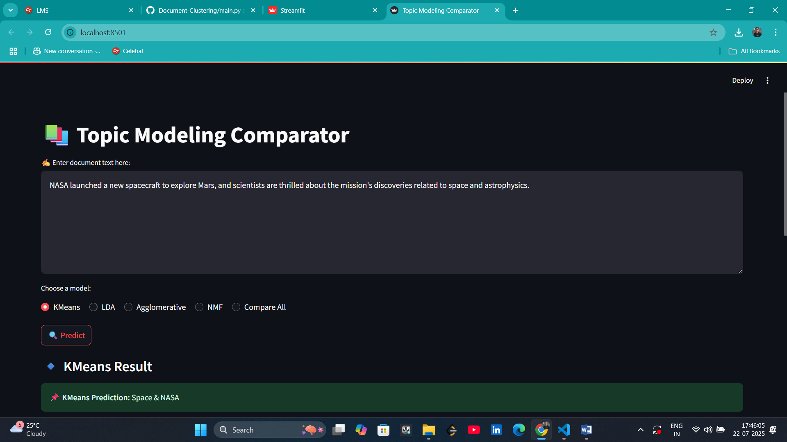
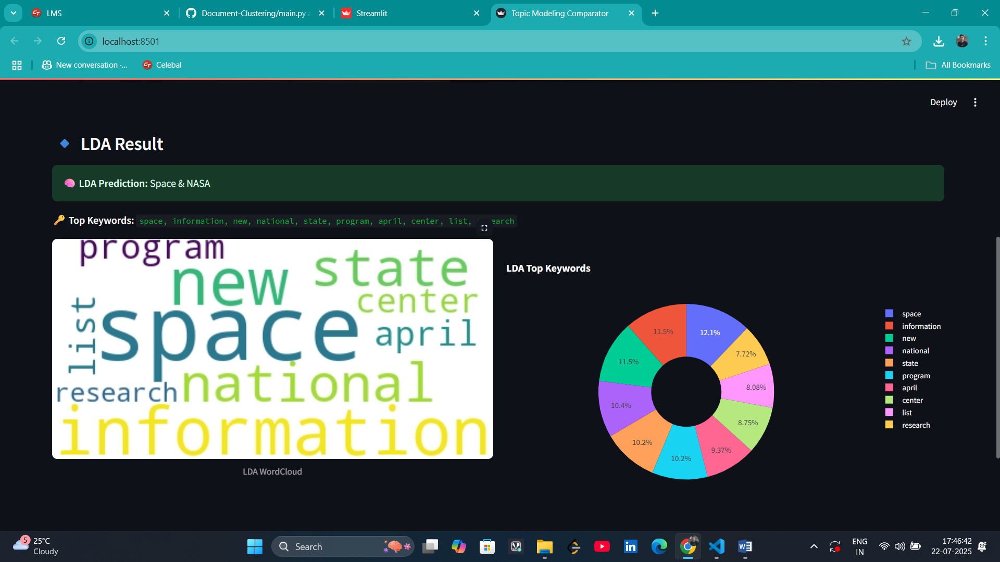

# 🚀 Celebal Summer Internship Project – Document Clustering for Topic Modeling (Data Science Domain)

This project was developed during the **Celebal Technologies Summer Internship** under the **CSI**. It is an end-to-end **Topic Modeling Comparator Web Application** that compares four major unsupervised learning algorithms for identifying hidden themes in user-provided text data.

---

## 🎯 Objective

To create a unified, interactive, and visually rich Streamlit web app that:

- Accepts document text from the user.
- Applies **KMeans**, **LDA**, **NMF**, and **Agglomerative Clustering** for topic modeling.
- Predicts the most relevant topic and top keywords for each model.
- Displays results using **word clouds** and **interactive donut charts**.
- Helps users compare multiple unsupervised NLP models.

---

## 🧠 Algorithms Used & Why

| Algorithm       | Description                                                                 |
|----------------|-------------------------------------------------------------------------------|
| **KMeans**      | Distance-based clustering using TF-IDF. Fast and scalable on large datasets. |
| **LDA**         | Probabilistic generative model. Offers interpretable topic-word distributions. |
| **NMF**         | Matrix factorization-based. Handles sparse data, produces distinct topics. |
| **Agglomerative** | Hierarchical clustering. Useful for smaller datasets, tree-based exploration. |

Using all four offers broader understanding of topic coherence, keyword separation, and clustering behavior.

---

## 🛠️ Technologies Used

- 🐍 Python 3.10+
- 🤖 scikit-learn – ML Models (KMeans, NMF, Agglomerative)
- 📚 Gensim – LDA Topic Modeling
- 🧼 NLTK – Text preprocessing
- 📊 Plotly – Donut chart visualizations
- ☁️ WordCloud – Word cloud generation
- 🔧 Joblib – Model serialization
- 🌐 Streamlit – Web app interface

---

## 📁 Project Structur


---

---

## 📸 Output & UI

- 🔘 Select model from radio: KMeans, LDA, NMF, Agglomerative, or Compare All
- 📌 Display of predicted **topic name**
- 🌐 WordCloud and 🔘 Donut Chart visualizations
- 📊 Keywords ranked by importance

#### 🔍 Example:

| Input | Detected Topic |
|-------|----------------|
| *NASA launched a satellite to explore deep space.* | **KMeans**: Space & NASA <br> **LDA**: Space & NASA <br> **NMF**: Space & Astronomy <br> **Agglo**: Science & Technology |

---

## 🖼️ Screenshots

<div align="center">
 


</div>

---

### 🎬 Watch Project Demo
[](youtube.com/watch?v=Sx8tpSFQCSA)


This video explains:

- Internship background
- Model training logic
- Streamlit frontend workflow
- Live input testing

---

## 📌 Project Highlights

✅ Full-stack machine learning application  
✅ Real-time inference and visualization  
✅ Comparison across four Clustering models  
✅ Deployment-ready with modular structure  
✅ Developed under **Celebal CSI Data Science Internship**

---

## 🧠 Future Enhancements

- 📄 Upload full PDFs or text files for analysis
- 🌍 Support for multilingual inputs
- 🤖 LLM-based topic summaries (GPT, LLaMA)
- 💾 Session history & exportable results
- 🔍 SHAP/ELI5 for model explainability

---
## 🚀 Run Locally

Follow the steps below to set up and run the project locally on your machine:

### ✅ Step 1: Clone the Repository

```bash
git clone https://github.com/shaikhimran1006/Document-Clustering.git
cd Document-Clustering
```

### ✅ Step 2: Install Dependencies

```bash
pip install -r requirements.txt
```

### ✅ Step 3: Run the Streamlit App

```bash
streamlit run app/main.py
```
---

## 📢 About the Internship

This project is developed as part of my **Summer Internship at [Celebal Technologies](https://www.celebaltech.com/)**, under the mentorship of the **Data Science** and **Center for Smart Infrastructure (CSI)** team.

### 👨‍💻 What I Learned

- 🧠 Deploying machine learning models in real-world apps  
- 🔁 Comparing multiple NLP techniques like **KMeans**, **LDA**, **NMF**, and **Agglomerative Clustering**  
- 📐 Preprocessing large-scale unstructured text data  
- 📊 Creating intuitive data visualizations using **WordCloud** and **Plotly**  
- 🌐 Building a clean, interactive UI using **Streamlit**  
- 🔍 Delivering model results in real time for topic understanding

---

## 🙋‍♂️ Author

**Imran Shaikh**  
🎓 B.Tech in Information Technology  
🏫 Walchand Institute of Technology  
📫 Email: [imran1006shaikh@email.com](mailto:imran1006shaikh@email.com)  
🔗 LinkedIn: [linkedin.com/in/your-profile](https://www.linkedin.com/in/imran1006/)
